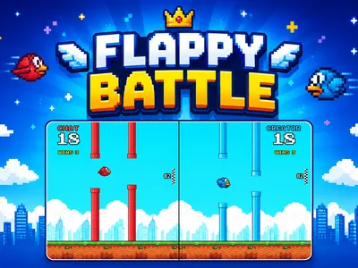
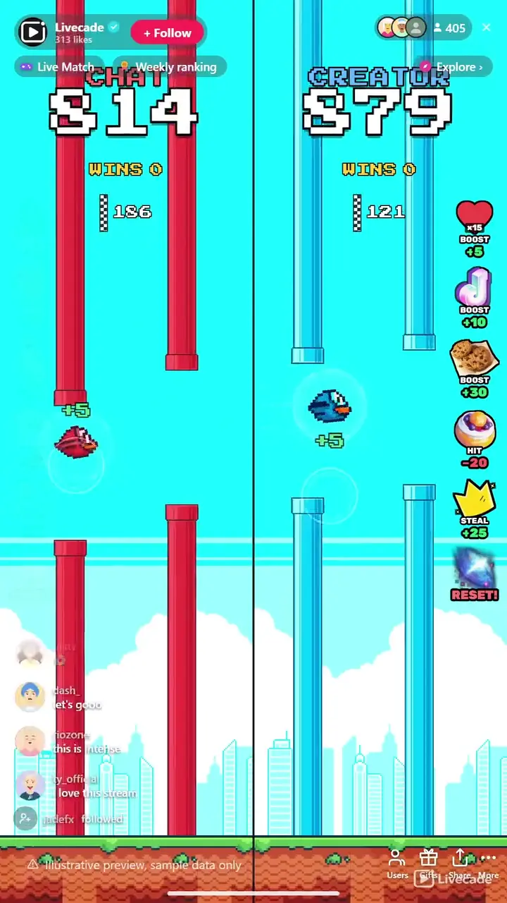

# Flappy Battle - Interactive TikTok Live Game

> Chat versus creator. Boost, hit, and steal your way to the target.

Two birds, one screen, both flying themselves. Viewers gift to boost their side, knock the enemy back, or steal points straight across the divide. First side to the target takes the round, and only the winner resets, so the race never stalls.

**[Play Flappy Battle on Livecade](https://livecade.io/games/flappy-battle/?utm_source=github&utm_medium=readme&utm_campaign=flappy-battle)** - runs as a single browser source in OBS, Streamlabs, or TikTok LIVE Studio. Nothing for viewers to install.

## How viewers play

Viewers take part with the actions TikTok already gives them: **likes**, **follows**, **gifts**. Every action below is rebindable, so you decide which interaction drives which effect.

| Action | What it does |
| --- | --- |
| **Boost** | Surges your bird forward and adds points to your side |
| **Hit** | Knocks the rival bird back and stuns it, taking points off that side |
| **Steal** | Moves points straight from the enemy side onto yours |
| **Reset** | Wipes a side back to zero and takes its session wins with it, the biggest swing in the game |

## How it works

### The birds fly themselves

Both birds are on autopilot through their own endless pipe course, so there is no skill gate and nothing to learn. What your viewers change is speed: a boost sends a bird surging forward through the pipes it was paid for.

### Gifts boost, hit, or steal

Small gifts push your own bird forward, bigger gifts knock the rival bird back and stun it, and the priciest gifts take points off the enemy and add them to your side at the same time.

### Free viewers boost too

A follow boosts the left side and every fifteenth like boosts the right, so viewers who never spend a coin still move the race, and both are rebindable to anything you want.

### Only the winner resets

Hitting the target banks a win and carries the overshoot into the next round, while the loser keeps its score. The race restarts instantly with no dead pause.

## About the game

Flappy Battle splits the screen down the middle and gives each side its own bird, its own pipes and its own score. Nobody has to play well, because nobody plays at all: both birds fly themselves through their own endless course, and what your audience controls is how fast each one gets there. A follow boosts one side and every fifteenth like boosts the other, so the free tier is something viewers were going to do anyway.

### Every gift does something you can see

Small gifts boost your bird forward in a visible surge of speed, mid-tier gifts knock the enemy bird back and stun it, and the priciest gifts steal points straight across the divide, helping your side and hurting theirs in the same moment. Every action credits the viewer who sent it, and the bird actually flies the distance their gift bought instead of a number simply ticking up.

### Nobody watches their spend vanish

Reach the target first and that side banks a win and starts the next round on whatever it overshot by, while the loser keeps every point it had. There is no pause and no restart for everyone, so a viewer who gifts right after a round still sees their points land. A running win tally tracks who is actually ahead across the whole session.

### Reset is the ultimatum

The most expensive action in the game does not just wipe a side back to zero, it takes the session wins that side has banked. Every other action costs points a side can re-earn within a round; this one costs the whole stream. It sits at the top of the ladder because it is the single most valuable thing a viewer can buy.

## What it looks like on stream

[Watch Flappy Battle gameplay](https://cdn.livecade.io/games/flappy-battle.mp4)

## What you can configure

- **Interface language** - Twelve languages for the on-screen chrome
- **Side names** - Rename each side, defaults to Chat vs Creator
- **Bird and pipe colors** - Pick the bird and pipe color for each side from the built-in sprite set
- **Points to win a round** - How many points a side needs to bank a win
- **Bird and pipe style** - Two bird styles and five pipe styles
- **Sky** - Day, sunset, dusk, night, city lights or midnight, plus an optional grass strip
- **Custom background per side** - Swap in your own image behind either lane
- **Win celebration** - Full screen, subtle, or off, so it can stay clear of a face cam

## Languages

English, Spanish, Portuguese, French, German, Italian, Indonesian, Arabic, Turkish, Russian, Hindi, Romanian

## FAQ

<strong>How do viewers interact with Flappy Battle?</strong>

Viewers send gifts to boost their side, knock the rival bird back, or steal points across the divide. A follow and a like streak boost the two sides for free, and every action is rebindable to whichever gift or trigger you want.

<strong>Do viewers control the birds?</strong>

No, and that is the point. Both birds fly themselves through their own pipe course, so there is nothing to learn and no way to play badly. Your audience controls how fast each side gets to the target, not the flying.

<strong>What happens when a side reaches the target?</strong>

That side banks a win and starts the next round on whatever it went over by, so points a viewer paid for are never binned. The other side keeps its score, and play continues immediately with no restart.

<strong>Is it chat versus the creator, or can I set up team vs team?</strong>

It defaults to Chat versus Creator, but both sides are rename-able and re-colorable, so you can run any two-way rivalry you want.

<strong>How do I add Flappy Battle to my TikTok Live?</strong>

Add one browser source URL to OBS or your streaming software and go live. There is no plugin to install and nothing for your viewers to download.

## Setup

1. [Create a Livecade account](https://app.livecade.io/register?utm_source=github&utm_medium=cta&utm_campaign=flappy-battle)
2. Copy your overlay browser source URL
3. Paste it into OBS, Streamlabs, or TikTok LIVE Studio
4. Pick Flappy Battle, set your triggers, and go live

Runs in the browser, so it works on Windows and macOS with nothing to download. [See all TikTok Live games](https://livecade.io/tiktok-live-games/?utm_source=github&utm_medium=readme&utm_campaign=flappy-battle).

---

_This repository documents Flappy Battle, a hosted interactive game by [Livecade](https://livecade.io/?utm_source=github&utm_medium=footer&utm_campaign=flappy-battle). The game runs on Livecade's platform, so there is no source to install here._
